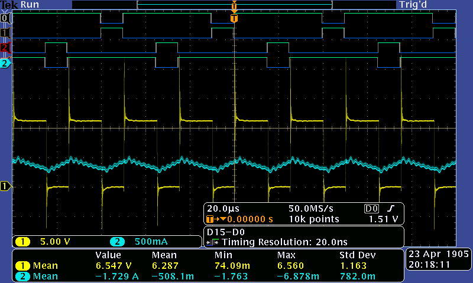
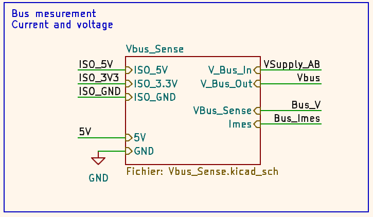
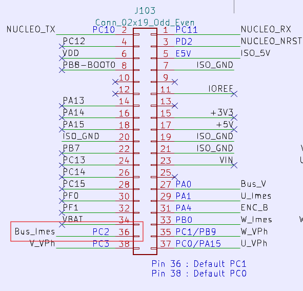

# 2526_ESE_AAA_xia_luo

## 6. Commande MCC basique

### 6.1. Génération de 4 PWM

- Fréquence de 20kHz :
   - f_clock = 170 MHz
   - on choisit PSC = 0 pour avoir le plus de résolution possible
   - comme on est en center align, la fréquence est divisé par 2 
   - on veut f = 20 kHz = f_pwm / 2 = f_clock / (2*ARR)
   - on choisit alors ARR = 4250 

- Temps mort minimum
  - Transistor du hacheur IRF540N :
    - rise time t_r : 44 ns
    - fall time t_f : 43 ns
    - turn off delay t_doff : 53 ns
    - turn on delay t_don : 11 ns
  - Si on somme on 151 ns
  - On utilise 200 ns pour plus de sécurité 
  - Pour avoir une temps mort de 200 ns :
     - On indique combien de fois on multiplie t_source = 1 / f_source = 1 / 170 MHz = 5.88 ns
     - Soit **34** * 5.88 ns = 200 ns
     - On indique dans l'ioc un deadtime de valeur **34**

- Résolution de 10 bits
   - On a ARR = 4250 > 1024
        
## 7. Commande en boucle ouverte, mesure de Vitesse et de courant

### 7.2. Mesure de courant

$$V_{out} = V_{ref} + G \cdot I_P$$

avec $$V_{ref}$$ = 1.65V.

G = 50mV/A.

$$I_P$$ le courant à mesurer.

### 7.3. Mesure de vitesse

$$H(s) = \frac{\text{Mesure (tops/s)}}{\text{Vitesse (tr/min)}} = \frac{4 \cdot N_{PPR}}{60}$$

avec $N_{PPR}$ : Le nombre d'impulsions par tour de l'encodeur.

$4$ : Facteur de multiplication du STM32 (mode quadrature).

$60$ : Conversion minutes en secondes.
